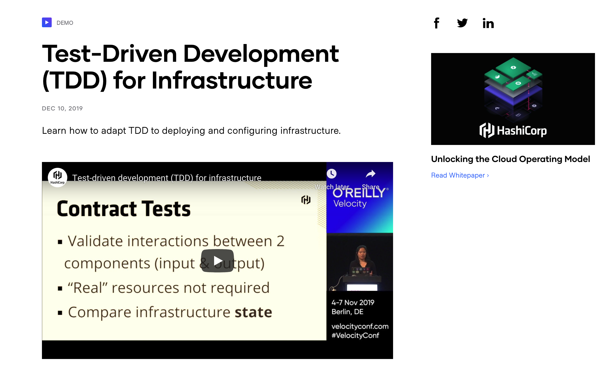

## ECE 555 Mehcatronics
1. Unmanned Vehcile

## ECE 558 DIS
1. Path finding
2. Sobel filters
3. Image Blending
4. SIFT

## ECE 560 Embedded Systems
1. FSM for IMU
2. Multicontrol buck converter
3. Synchronous touchscreen using RTOS

## ECE 542 Neural Network
1. Transfer Learning for Soyabean Wilting
2. Instance base Image segmentation using Mask RCNN for Self Driving Cars
4. Neural Style Transfer

## ECE 763 Computer Vision and Deep Learning
1. Mathematical distribution based (mean, covariance) Face classification
2. Adaboost Haar Feature for face detection
3. Babysiting CNN for face detection
4. Yolo object detection and tracking

## CSC 591 Software for Robotics
1. DDPG+HER for Fetch robot to reach desired object

## ECE 592 Topics in Data Science
1. ECG Prediction from IMU time series data using 1D CNN for dogs
2. Lossy Compression for images using K-Means clustering

## ROS
1. Roomba Robot Planning
2. Tennis Ball detetcion
3. Gazebo Design
4. Path Planning

## Sensor Fusion
1. Kalman Filter

## Computer Vision
1. Self Driving Cars
Embed any notable projects in this page.

For example, my favorite project would be linked and I can even embed
a screenshot or GIF to show it.

You can list [links](https://www.hashicorp.com/resources/test-driven-development-tdd-for-infrastructure)
or even embed images with the following Markdown:

